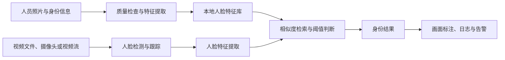

# Face Matching

本地优先的视频人脸比对与命中告警系统。系统预先录入带有 ID、姓名及其他信息的人员照片，在本地视频、摄像头或网络视频流中检测人脸，并与已登记的人脸库进行比对。

> 项目状态：需求与技术方案设计阶段，功能尚未实现。

## 项目目标

- 在 Windows 11 本机完成照片录入、人脸特征提取、视频分析和身份比对。
- 支持 NVIDIA GPU 加速，并在 GPU 不可用时提供 CPU 回退模式。
- 对命中人员生成结构化事件，可用于界面提示、声音提醒、日志记录或对接外部告警系统。
- 默认在本地保存和处理人脸数据，不依赖云端服务。

## 计划功能

### 1. 人员与照片库

- 录入人员 ID、姓名和自定义信息。
- 每个人可录入一张或多张照片。
- 检查照片中的人脸数量、清晰度和可用性。
- 为照片生成并保存人脸特征向量。
- 支持人员信息的新增、更新、停用和删除。
- 支持从目录和结构化清单批量导入。

建议的数据组织方式：

```text
data/
  people/
    person-001/
      profile.json
      01.jpg
      02.jpg
    person-002/
      profile.json
      01.jpg
```

`profile.json` 示例：

```json
{
  "id": "person-001",
  "name": "示例人员",
  "metadata": {
    "group": "demo"
  }
}
```

### 2. 视频输入

- 本地视频文件，例如 MP4、MOV、AVI 和 MKV。
- 本机摄像头或 USB 摄像头。
- RTSP、HTTP 等网络视频流。
- 通过统一输入接口扩展其他视频源。

### 3. 人脸检测与比对

- 在视频帧中检测一个或多个人脸。
- 对连续帧中的同一人脸进行跟踪，减少重复计算和重复告警。
- 对人脸进行对齐、质量过滤和特征提取。
- 在已登记人脸库中执行一对多相似度检索。
- 通过可配置阈值输出“已命中”或“未知人员”。
- 保留相似度、时间、视频源和人员信息，便于复核。

### 4. 结果与告警

- 实时画面叠加人脸框、姓名、人员 ID 和相似度。
- 保存命中截图和结构化事件日志。
- 导出 JSON 或 CSV 结果。
- 支持告警冷却时间，避免同一人员在短时间内重复报警。
- 预留 Webhook 和 API，可接入消息、邮件或其他告警平台。

## 处理流程



## 目标运行环境

项目必须支持 Windows 11 64 位原生运行，首要验证设备如下：

| 项目 | 配置 |
| --- | --- |
| 设备 | 华硕 ROG G22CH 台式机 |
| CPU | Intel Core i7-14700KF |
| GPU | NVIDIA GeForce RTX 4070 SUPER 12GB |
| 内存 | 64GB |
| 操作系统 | Windows 11 64 位 |

### 初始兼容基线

- Python 3.11 64 位。
- NVIDIA 显卡驱动，以及与项目锁定版本匹配的 CUDA/cuDNN 运行库。
- GPU 推理优先使用 ONNX Runtime CUDA Execution Provider。
- CPU 模式使用 ONNX Runtime CPU Execution Provider，功能保持一致，但处理速度可能较低。
- OpenCV 负责视频文件、摄像头和网络视频流的读取与画面处理。
- 项目的正式依赖版本将在代码实现时写入锁定文件，避免不同版本的 CUDA、cuDNN 和推理运行库混用。

首个可运行版本计划以 Python 3.11、ONNX Runtime GPU 1.26.x、CUDA 12.8 和 cuDNN 9.x 作为 GPU 兼容组合。ONNX Runtime 官方说明该版本组合支持 Windows x64 的 NVIDIA CUDA 推理；如实际模型依赖要求不同，将以自动化环境检查和本机验证结果为准。

## 本机运行要求

- 不要求 WSL 或 Docker，首个版本应能直接从 Windows PowerShell 启动。
- 启动时检查 Python、GPU、CUDA 推理后端、模型文件和视频解码能力。
- GPU 初始化失败时给出明确原因，并允许用户选择 CPU 回退模式。
- 默认数据目录、模型目录和日志目录均可配置。
- 不在未经用户确认的情况下上传照片、人脸特征、视频或命中记录。
- 每个发布版本都需要在上述 ROG G22CH 设备或等效 Windows/NVIDIA 环境完成基础验证。

## 计划命令行接口

以下命令用于定义预期使用方式，当前尚未实现：

```powershell
# 导入人员照片库
python -m face_matching enroll --input .\data\people

# 分析本地视频
python -m face_matching run --source .\samples\demo.mp4

# 分析本机摄像头
python -m face_matching run --source 0

# 分析 RTSP 视频流
python -m face_matching run --source "rtsp://example/stream"
```

## MVP 验收范围

- 成功导入包含 ID、姓名和照片的人员库。
- 支持 MP4 视频、本机摄像头和至少一种 RTSP 视频流。
- 在视频中检测人脸并返回最佳匹配身份和相似度。
- 未达到阈值时明确标记为未知人员。
- 可生成带标注的视频画面、命中截图和事件日志。
- 在目标 Windows 11 主机上启用 RTX 4070 SUPER GPU 推理。
- GPU 不可用时可以切换至 CPU 完成相同流程。
- 对相同人员的连续命中进行合并和告警去重。

## 性能与准确率

项目不会预设未经测试的帧率、延迟或准确率指标。实现后将使用固定测试视频和登记照片，在目标主机上记录：

- 不同分辨率和视频源下的平均处理帧率与延迟。
- GPU 显存、系统内存和 CPU 占用。
- 不同人脸大小、角度、光照和清晰度下的匹配效果。
- 不同阈值下的误报率和漏报率。

## 数据与使用边界

人脸特征属于敏感生物识别数据。使用者应确保拥有照片和视频的合法处理权限，并根据适用规则落实授权、访问控制、保存期限和删除机制。匹配结果应保留人工复核途径，不应仅凭自动结果作出高风险决定。

## 技术参考

- [ONNX Runtime CUDA Execution Provider](https://onnxruntime.ai/docs/execution-providers/CUDA-ExecutionProvider.html)
- [ONNX Runtime Windows](https://onnxruntime.ai/docs/get-started/with-windows.html)
- [PyTorch on Windows](https://docs.pytorch.org/get-started/locally/)

